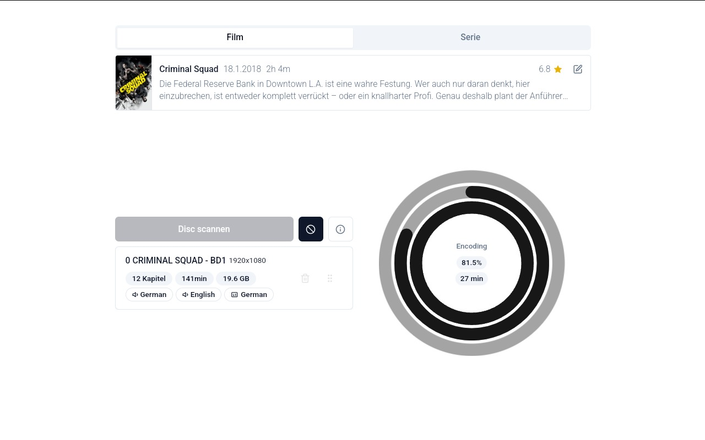

> 📜 This software is intended to be used for personal backups and educational purposes only. Check your local laws before using this software. For example, in Germany, it is illegal to circumvent DRM, even for personal backups, which is why I only rip discs that I own and do not have DRM of course.

> 💡 However, I do not support either piracy or DRM. Piracy is unethical for people to make copies of movies and music they do not own. However, there is a distinction between piracy and copying for fair use, which publishers often mistakenly group together. What truly frustrates me is DRM. It is a waste of time. I should not have to deal with region codes or use software like MakeMKV to decrypt a movie that I legally purchased! Unfortunately, the existing copy-protection methods fail to stop piracy and only serve to inconvenience legitimate customers. For example, non of my devices can even play the Deadpool movie I bought because of the DRM on this disc.

# Ripper

👇 An automatism for using MakeMKV and Handbrake to backup your owned DVD or Blue-Ray Discs written purely in Rust 🦀



## ✨ Features

- [x] 📀 **Automated Ripping**: Rip your DVDs and Blue-Rays with MakeMKV
- [x] 🎞 **Automated Encoding**: Encode your ripped movies or tv shows with Handbrake using different and already provided presets
- [x] 📺 **Sonarr and Radarr Integration**: Automatically uploads your encoded movies or tv shows to your own Sonarr or Radarr instance
- [x] 🌐 **Headless**: Designed to be run from a Linux server
- [x] 📡 **Remote Control**: Control the service via a user friendly react web interface
- [x] 🚀 **Fast**: Written in Rust for maximum performance
- [x] 📦 **Easy to use**: Just provide a config file and you are ready to go
- [ ] 📋 **Deployment**: Easy deployment to your server using Infrastructure as Code and Docker

## 💾 Get the executable

> Currently we do not provide precompiled binaries. You have to compile the project yourself. This required [git](https://git-scm.com/) and [Cargo](https://www.rust-lang.org/tools/install). You may need to install additional dependencies like `libudev-dev` and `pkg-config` on your system (`sudo apt-get install libudev-dev pkg-config`).

```bash
# Create the directory
mkdir ~/ripper-deployment
mkdir ~/ripper-deployment/output
mkdir ~/ripper-deployment/profiles

# Build the rust executable
git clone https://github.com/DevTobias/ripper.git
cd ~/ripper/services/autoripper
cargo build --release
mv -f config.example.json ~/autoripper/config.json
mv -f ../../target/release/ripper ~/autoripper/

# Copy default profiles
cd ~/ripper/
cp -r .profiles/* ~/ripper-deployment/profiles/

# Download the frontend from GitHub into the folder

# (Optional) Enable the ripper to run as a service
sudo mv ~/ripper/services/autoripper/deployment/autorip.service /etc/systemd/system/
sudo systemctl daemon-reload
sudo systemctl start autorip
sudo systemctl enable autorip
```

### Install MakeMKV

```bash
sudo apt-get install build-essential pkg-config libc6-dev libssl-dev libexpat1-dev libavcodec-dev libgl1-mesa-dev qtbase5-dev zlib1g-dev

cd ~/downloads
wget -c https://www.makemkv.com/download/makemkv-bin-1.17.7.tar.gz -O - | tar -xz
wget -c https://www.makemkv.com/download/makemkv-oss-1.17.7.tar.gz -O - | tar -xz

cd ~/downloads/makemkv-oss-1.17.7
./configure
make
sudo make install

cd ~/downloads/makemkv-bin-1.17.7
make
sudo make install

rm -rf ~/downloads
```

### Install Handbrake

```bash
sudo apt-get install handbrake-cli
```

# ⚖ License

This project is licensed under the MIT License - see the [LICENSE](LICENSE) file for more details.
